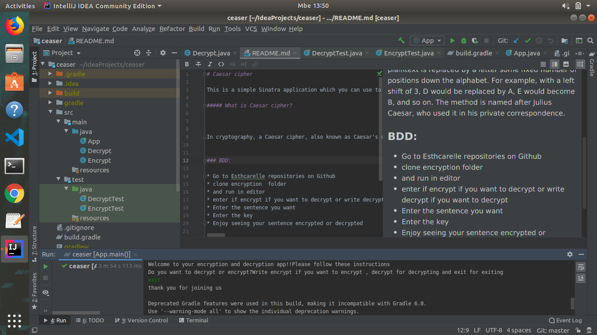

# Caesar cipher
## made by Esther Carrelle

This is a simple java application which you can use to encrypt or decrypt a piece of text. 

##### What is Caesar cipher?

In cryptography, a Caesar cipher, also known as Caesar's cipher, the shift cipher, Caesar's code or Caesar shift, is one of the simplest and most widely known encryption techniques. It is a type of substitution cipher in which each letter in the plaintext is replaced by a letter some fixed number of positions down the alphabet. For example, with a left shift of 3, D would be replaced by A, E would become B, and so on. The method is named after Julius Caesar, who used it in his private correspondence.
##Known  Bugs
There is no none bugs in this app

### BDD:

* Go to Esthcarelle repositories on Github
* clone encryption  folder
* and run in editor
* enter if encrypt if you want to decrypt or write decrypt if you want to decrypt
* Enter the sentence you want
* Enter the key
* Enjoy seeing your sentence encrypted or decrypted

##  Screenshots

### Technology used

* Written in java using IntelliJ
##  Support and contact details
 Esthcarelle@gmail.com
## Licence
copyright @2019 Esther carrelle